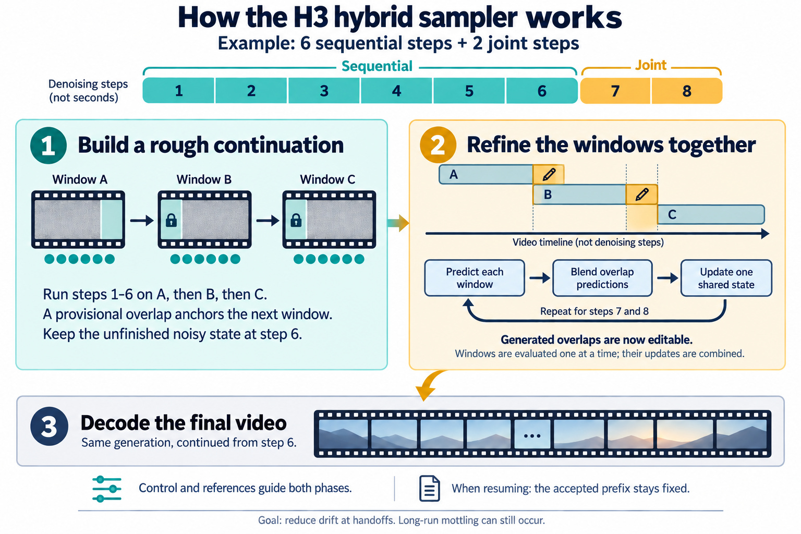
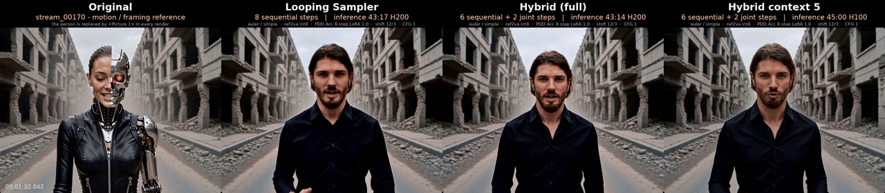
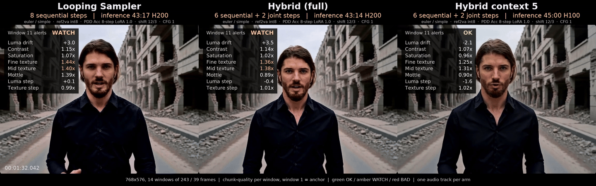

# Hybrid Windows for ComfyUI

Experimental H3 hybrid sampling through **two stock KSampler Advanced nodes** or a **single Hybrid Window Sampler**.

**Use plain `euler` in both samplers.** The supplied PDD examples use `simple`.
Hybrid sampling is not inherently PDD-only: non-PDD DMD Turbo runs have also
completed with `simple` and `beta57` in the earlier MMH3 hybrid implementation.
See the compatibility table below for the implementation and test scope.



The diagram illustrates the hybrid concept.

The examples have three native prompt text boxes, image conditioning,
native PDD LoRA loading, native AV decoding, optional color stabilization and Save Video.

Hybrid sampling supports H3. The decoded-frame color node can be used with other
models and samplers.

## Example: Looping Sampler vs Hybrid on a two-minute clip

Same clip, same reference picture, same model chain, same compute; only the sampler differs.
Left to right: the motion-reference clip (`stream_00170`, the MMH3Tools example video, its
person replaced by `<Picture 1>` in both renders), the **MMH3 Looping Sampler** (8 sequential
steps per chunk) and **Hybrid Windows** (6 sequential + 2 joint steps). 14 windows of 243 frames
with a 39-frame overlap = 2895 frames / 120.6 s at 768x576, seed 123, Ref2VA int8 + the native
PDD 8-step LoRA at 1.0, euler / simple, CFG 1, plain SDPA attention, one prompt for every window,
no post-processing. Both arms run 112 model evaluations; pure sampling time 43:17 vs 43:14.

[](https://github.com/Jalen-Brunson/ComfyUI-HybridWindows/releases/download/examples-stream00170/stream00170_Original_Looping_Hybrid.mp4)

*6-second excerpt at 1:32 (window 12 of 14). Click it for the full 120-second video with audio
(track 1: left = Looping, right = Hybrid; track 2: the original's audio).*

[](https://github.com/Jalen-Brunson/ComfyUI-HybridWindows/releases/download/examples-stream00170/stream00170_Looping_vs_Hybrid_chunk_metrics.mp4)

*The same excerpt with the per-window chunk-quality panels (window 1 is the anchor; amber =
WATCH). Click for the full video.*

Full-length videos (release assets):
[Looping vs Hybrid](https://github.com/Jalen-Brunson/ComfyUI-HybridWindows/releases/download/examples-stream00170/stream00170_Looping_vs_Hybrid_clean.mp4) ·
[with metrics](https://github.com/Jalen-Brunson/ComfyUI-HybridWindows/releases/download/examples-stream00170/stream00170_Looping_vs_Hybrid_chunk_metrics.mp4) ·
[Original | Looping | Hybrid](https://github.com/Jalen-Brunson/ComfyUI-HybridWindows/releases/download/examples-stream00170/stream00170_Original_Looping_Hybrid.mp4) ·
colour-corrected: [Looping vs Hybrid](https://github.com/Jalen-Brunson/ComfyUI-HybridWindows/releases/download/examples-stream00170/stream00170_Looping_vs_Hybrid_color_clean.mp4) ·
[with metrics](https://github.com/Jalen-Brunson/ComfyUI-HybridWindows/releases/download/examples-stream00170/stream00170_Looping_vs_Hybrid_color_chunk_metrics.mp4) ·
[Original | Looping | Hybrid](https://github.com/Jalen-Brunson/ComfyUI-HybridWindows/releases/download/examples-stream00170/stream00170_Original_Looping_Hybrid_color.mp4).
Stills at 1:40: [original / looping / hybrid](docs/examples/original_looping_hybrid_100s.png),
[metrics overlay](docs/examples/looping_vs_hybrid_metrics_100s.png),
[colour-corrected](docs/examples/original_looping_hybrid_color_100s.png),
[colour-corrected with metrics](docs/examples/looping_vs_hybrid_color_metrics_100s.png).

| Measured on the finished videos | Looping Sampler (8) | Hybrid (6 + 2) |
|---|---|---|
| Pure sampling time | 43:17 | 43:14 |
| ArcFace likeness to the reference picture, whole clip (median / p10) | 0.649 / 0.581 | 0.736 / 0.693 |
| Likeness, window 1 → window 14 | 0.72 → 0.56 | 0.75 → 0.71 |
| Fine texture at window 14 (ratio to the clip's own first window) | ×1.56 | ×1.45 |
| Skin colour patchiness ("mottle") at window 14 | ×1.54 | ×1.00 |
| First WATCH verdict of the chunk-quality readout | window 7 | window 9 |

Both renders drift in the same direction over two minutes (the usual contrast and texture climb
of chained H3 generation; neither reaches BAD). The hybrid drifts less and, most visibly, keeps
the reference identity flat across the whole clip where the sequential chain loses it steadily.
This is one seed on one clip; it isolates the sampler, not a full production pipeline.

The colour-corrected variants apply the same chroma-only grade to both renders (tint and
saturation nudged back toward each clip's first eight seconds, following the source's own colour
trajectory; brightness, contrast, texture and audio untouched). The exact API payloads of both arms,
the builder that produced them and the colour-grade command are in
[docs/examples/compare_stream00170](docs/examples/compare_stream00170/).
## Single-sampler reference-image example

Open [H3 Hybrid R2V - single sampler.json](example_workflows/H3%20Hybrid%20R2V%20-%20single%20sampler.json) in ComfyUI. An [API graph](example_workflows/H3%20Hybrid%20R2V%20-%20single%20sampler.api.json) is included.

This sampler moved from **ComfyUI-MMH3Tools** into this repository. Its node ID remains `MMH3HybridWindowSampler`, so existing workflows keep their connections. Update both packs and restart to avoid duplicate registration. The single sampler requires MMH3Tools for its shared window, conditioning and mask helpers; the original two-KSampler examples do not.

The example has **16 native nodes**, **MMH3 Cond To Set**, and **H3 Hybrid Window Sampler**. Native H3 Ref2VA conditioning receives the loaded reference image; Cond To Set reuses that conditioning across three windows. Native noise, Euler selection and sigma scheduling feed the sampler, followed by native video/audio decoding and Save Video.

1. Copy the bundled [reference portrait](example_workflows/assets/ref2va_stock_portrait.jpg) into `ComfyUI/input/hybrid_windows/`, or upload your own image in Load Image. Asset credits are in the assets folder.
2. Select the Ref2VA base, matching PDD LoRA, H3 text encoder and both VAEs listed below. Edit the native conditioning prompt; `<Picture 1>` identifies the reference.
3. Queue to generate **651 frames at 832 × 480, 24 fps** with **243-frame windows / 39-frame overlap**, **6 sequential + 2 joint Euler steps**, CFG 1, and video/audio shifts 12/3. Output saves under `output/video/HybridSampler_Ref2VA`.

Set `sequential_steps = 8` for the sequential baseline. For another duration, match Cond To Set's count and the empty latent length: `total = window + (count - 1) × (window - overlap)`. Keep conditioning and latent dimensions identical. Connect the model before any Context Windows node; this sampler owns windowing. The sample starts fresh with accepted prefix and start window both zero.

Rebuild with `python build_sampler_workflow.py`. Validate with `python tests/validate_sampler_workflow.py` and run the sampler state tests with `python tests/test_hybrid_sampler.py` from this repository in the ComfyUI environment. Graph validation and CPU sampler tests do not establish rendered visual quality.

## Single hybrid sampler

**H3 Hybrid Window Sampler** (`MMH3HybridWindowSampler`) and its joint-stage helpers are provided by this repository. It uses the public MMH3Tools window/AV utilities and conditioning type; it does not require `MMH3JointWindowSampler` or local-only MMH3Tools files. Keep the node ID when updating existing workflows. Plain Euler with zero churn is required. The default is six sequential steps followed by two joint steps.

## Accessible 05 workflow

[05A Hybrid - accessible fresh inpaint](example_workflows/05A%20Hybrid%20-%20accessible%20fresh%20inpaint.json) starts with **Load source video → Write prompt → Add reference images → Define blur**, followed by Queue. Its instruction panels include [model download links and folders, chunks, blur/noise, optional hair segmentation, masks and audio](docs/accessible-workflow.md).

Install **ComfyUI-HybridWindows**, **ComfyUI-MMH3Tools**, **ComfyUI-VideoHelperSuite**, [**h3_face_tools**](https://github.com/Jalen-Brunson/h3_face_tools), **ComfyUI-Sapiens2**, and [**ComfyUI-MiniMaxH3Mod**](https://github.com/Luisacaotica/ComfyUI-MiniMaxH3Mod). Face analysis needs InsightFace/buffalo_l and a compatible ONNX Runtime. The Sapiens2 checkpoint is needed only when enabling hair segmentation. None of the excluded `vlm_video_prompt`, `wan_chunk_io`, `path_tools`, `minimax_h3_mask_tools` or `MaskVidExperiments` nodes is used.

The clear source feeds video/audio encoding. A second branch runs **face blur → native Image Add Noise (0.10) → Image Composite Masked → Control 1**. The source therefore supplies the first control automatically. **Inpaint mask**, **Control 2**, and **Sapiens2 Hair region mask** are separate optional groups, all muted by default. Enable a group by setting all its nodes to Always. Disabled groups need no input files or model execution.

The inpaint mask, when enabled, controls both sampler preservation and where noise is composited into Control 1. Without it, the full picture may regenerate and noise affects the full control image. Sapiens2 extracts Hair from the clear source and feeds the face node's region_mask, without an external hair-mask loader. It does not replace the inpaint mask.

The optional **Load H3 RefMods → Apply H3 RefMods to Cond Set** branch applies saved mods to every chunk before the control references. All loader slots default to `(none)`, which leaves conditioning unchanged. No trainer/extractor is included; see the workflow’s RefMods instruction panel.

Defaults: **832 × 480, two 124-frame windows, 39-frame overlap, 209 frames at 24 fps, Euler/simple, 6+2 steps**, with the 05 flow's DMD Turbo LoRA. The original beta57 schedule needs an extra extension and is not reproduced here. Enter one pipe-separated prompt per window. Source audio is preserved by default; the output uses the original loaded soundtrack directly.

This fresh-run edition omits automatic project/prompt-file handling, accepted-prefix resume/master assembly, persistent source-encode caching, delayed schedules, audio frame ranges and diagnostic branches. RefMod loading and application are included; the trainer/extractor, background removal and custom attention patches are omitted. The original 05 is unchanged.

`python build_accessible_workflow.py` rebuilds the shareable UI/API examples and local copy in `user/default/workflows/H3 Diagnostics/`, preserving local widget settings where node titles match. The repo example uses placeholder paths. `python tests/validate_accessible_workflow.py` checks optional branch combinations, excluded imports, layout, mask behavior, noise compositing and Hair extraction on CPU. It does not perform a GPU render or segmentation-model inference.

## Speed LoRA, sampler and scheduler compatibility

“Completed” means the combination produced output in a recorded test. It does
not establish the best visual quality, long-video stability, or compatibility
with every H3 conditioning mode. The native adapter does not require a PDD
LoRA, but it does require **plain Euler without churn or random inpaint noise**.

| Speed LoRA / setup | Sampler | Scheduler | Steps / split | Evidence and scope |
|---|---|---|---|---|
| [MiniMax-H3-Ref2VA-Acc-8Step_comfy.safetensors](https://huggingface.co/Kijai/MiniMax-H3-experimental/blob/main/loras/MiniMax-H3-Ref2VA-Acc-8Step_comfy.safetensors) (PDD) | `euler` | `simple` | 8 / 6+2 | Supplied and tested native Ref2VA workflow. CFG 1; video/audio shifts 12/3. |
| [MiniMax-H3-FL2VA-Acc-8Step_comfy.safetensors](https://huggingface.co/Kijai/MiniMax-H3-experimental/blob/main/loras/MiniMax-H3-FL2VA-Acc-8Step_comfy.safetensors) (PDD) | `euler` | `simple` | 8 / 6+2 | Supplied and tested native FL2VA workflow. CFG 1; video/audio shifts 12/3. |
| [minimax_h3_dmd_8step_turbo.safetensors](https://huggingface.co/drbaph/MiniMax-H3-Turbo-Lora-ComfyUI/blob/main/experimental/minimax_h3_dmd_8step_turbo.safetensors) (non-PDD) | `euler` | `simple` | 8 / 6+2 | Completed a 243-frame test with the earlier `MMH3HybridWindowSampler`, Ref2VA base, LoRA strength 1, CFG 1 and shifts 12/3. Not yet verified in this pack's native adapter. |
| [minimax_h3_dmd_8step_turbo.safetensors](https://huggingface.co/drbaph/MiniMax-H3-Turbo-Lora-ComfyUI/blob/main/experimental/minimax_h3_dmd_8step_turbo.safetensors) (non-PDD) | `euler` | `beta57` | 8 / 6+2 | Completed a 243-frame test with the earlier `MMH3HybridWindowSampler`, using the same base, strength, CFG and shifts. Not yet verified in this pack's native adapter. |
| Other speed LoRAs or scheduler combinations | `euler` | LoRA-specific | LoRA-specific | Not verified. Use the LoRA's intended base model, schedule, step count and CFG; an available dropdown entry is not compatibility evidence. |
| Any LoRA | `euler_ancestral`, Heun, DPM++, UniPC or other non-Euler solvers | Any | Any | Unsupported by this adapter. Its warmup state handling is specific to plain Euler. |

**Both samplers must use the same scheduler, total step count and model sigma
shifts.** The first sampler's end step must equal the second sampler's start
step. Mixing schedules between stages is unsupported.

Set **Switch at step = 8** for the **8 + 0 sequential baseline**. Each window
finishes before passing its overlap to the next; the second stock sampler
passes the completed latent through unchanged. The shared **Total steps** value
also connects to Hybrid Windows. Use this baseline to compare sequential carry
with joint finishing while keeping the seed, prompts and inputs fixed.

## Included custom nodes

The pack installs **four custom nodes**. The H3 nodes are under
`sampling/hybrid`; Video Color Stabilize is under `image/video`.

| Node | What it does | Used in the examples |
|---|---|---|
| **H3 Hybrid Window Sampler** (`MMH3HybridWindowSampler`) | Single-node sequential warmup and joint finish, including source masks and accepted-prefix preservation. Requires MMH3Tools. | Single-sampler Ref2VA |
| **H3 Hybrid Window Sampler** (`MMH3HybridWindowSampler`) | Runs sequential Euler warmup and joint-window finishing in one node. Requires public MMH3Tools utilities. | Accessible 05A |
| **H3 Hybrid Windows** (`H3HybridWindows`) | Arranges prompt conditioning into overlapping windows. Outputs a `sequential_model` for early sampling with overlap carry, a `joint_model` for finishing with shared overlap predictions, the connected `positive` conditioning, the calculated `total_frames`, the `latent` to sample, and a `report`. Connect the two models to the two native sampler nodes. Optional inputs cover a production graph: an MMH3 `cond_set` instead of the prompt sockets, a source `latent` with `denoise_mask` / `audio_denoise_mask` for v2v inpainting, `accepted_prefix_frames` + `start_window` for an accepted-prefix resume, and `noise_mode`. | Both Ref2VA and FL2VA |
| **H3 Window ControlNet** (`H3HybridControlNet`) | Applies ComfyUI's native H3 FUN control to the correct source frames for each window. Takes a model, FUN model patch, video VAE and control-frame batch; returns a model with control applied. Provides control strength and start/end timing. It does not extract pose, depth or edges from ordinary footage. | Optional; neither example uses it |
| **Video Color Stabilize** (`VideoColorStabilize`) | Reduces gradual tint and saturation drift in a decoded IMAGE batch, using an opening reference interval and optional aligned source frames. Preserves per-pixel brightness and smooths the correction over time. Returns corrected images. | Both; optional, enabled by default |

The model/LoRA loaders, image loaders, prompt text boxes, H3 conditioning,
KSampler Advanced, VAE decoders and video output nodes in the examples are
provided by ComfyUI itself.

## Source masks, resume and per-window noise

With none of these connected the node behaves exactly as the examples show. They
exist so a production graph -- v2v inpainting with an accepted-prefix resume --
can run on this chain instead of the single-node sampler.

- **`cond_set`** takes one conditioning per window from MMH3 Reference
  (Multi-Prompt), instead of the `positive_N` sockets. Connect one or the other.
- **`latent`** is the master to sample: a source encode for v2v, or a
  continuation master on resume. The node composes the masks and the accepted
  prefix into one per-row noise mask, so **sample the node's `latent` output**,
  not the master you connected.
- **`denoise_mask` / `audio_denoise_mask`** (white regenerates, black keeps the
  source) are reduced onto the latent grid by `denoise_mask_mode`. Pinned rows
  are held through both stages: the joint stage keeps the model looking at the
  clean source, so they are never re-injected from a half-denoised latent.
- **`accepted_prefix_frames`** holds a finished head fixed. Windows that lie
  entirely inside it skip the warm-up, and the output takes those rows from the
  input. It must be 0 or 5+17k frames.
- **`start_window`** is this run's first global window index (the resume shift);
  it seeds the per-window noise.
- **`noise_mode`**: `global` slices one draw, as before. `per_window` draws
  `seed + start_window + window index` per window, the same draws the
  single-node sampler makes, so a graph can be moved between the two samplers
  and compared.

Both samplers must run in one queue. The joint stage resumes the exact state the
warm-up left, and a restart in between loses it -- it says so rather than
sampling something wrong. Take the warm-up's `output`, never `denoised_output`.

A short latent is accepted: when the master is shorter than
`window + (count-1) * (window - overlap)` the last window slides back to end at
the clip, the way ComfyUI's own static window schedule does. That is what a
continuation master looks like on a project's last part.

## Optional color stabilization

Connect **VAE Decode → Video Color Stabilize → Create Video → Save Video**.
Audio connects directly to Create Video. Both examples include this wiring and
share one **Output FPS** value between the color node and Create Video.
The color math assumes SDR/sRGB frames with BT.709 luma coefficients.

Defaults are **enabled**, **strength 0.85**, **reference 1–8 seconds** and
**smoothing 2 seconds**, with **max_tint_shift 0.06**. Disable the node or set strength to zero for exact
frame passthrough. The reference interval is preserved; correction ramps in
over two seconds outside it. Use the generated opening as the reference rather
than an appearance-conditioning portrait with potentially different lighting.

For strong accumulated tint drift, use strength **1.0**. `max_tint_shift`
limits each Cb/Cr correction before strength is applied; 0.06 allows about
15 levels on a 0–255 scale. The previous fixed 0.025 limit could leave a
visible cast on long clips. This adjusts decoded output, not the latent
carried into the next generation window.

Without `source_frames`, the target is the opening's median tint and color
spread. Optionally connect original video frames **before noise or effects**,
with the same frame count, FPS and starting time as the generated images.
Resolution may differ. This follows source tint changes relative to its own
opening; source variation may raise the saturation target but does not lower
it below the generated opening. The node rejects mismatched frame counts to
avoid applying corrections at the wrong time. Leave this input disconnected
in the supplied image-conditioned examples.

This is intended for a **continuous shot**, processed as one complete IMAGE
batch. It keeps the same reference across generation-window boundaries.
Split footage at scene cuts. Whole-frame statistics also respond to changes
in composition, and without source frames the node can reduce intentional
color changes; lower strength or bypass it when needed.

Only chroma is adjusted: brightness, spatial detail and audio are not graded.
At saturated pixels, the color change is limited to stay within RGB gamut
while preserving luma. Sampling and latent carry are unchanged. This treats
visible color drift, not its inference cause or spatial mottling.

Processing uses CPU work on one frame at a time, with small temporal statistics
and one output batch. The complete input and output IMAGE batches still need
RAM; this node does not turn decoding/export into a streaming workflow. Color
is corrected before video encoding, avoiding a separate recompression pass.

## Installation

From your ComfyUI `custom_nodes` directory:

```bash
git clone https://github.com/Jalen-Brunson/ComfyUI-HybridWindows.git
```

Restart ComfyUI, then open an example:

- [R2V (Ref2VA): reference image](example_workflows/H3%20Hybrid%20R2V%20-%20native%20KSampler%20Advanced.json).
- [FL2VA: starting image and prompts](example_workflows/H3%20Hybrid%20FL2VA%20-%20native%20KSampler%20Advanced.json).
- [FL2VA: optional recurring ending guide](example_workflows/H3%20Hybrid%20FL2VA%20-%20recurring%20end%20guide.json).

This pack uses ComfyUI's existing Python dependencies. Model weights are downloaded
separately. Example images are included in [example_workflows/assets](example_workflows/assets/README.md).
Each workflow includes a **READ ME** note with model download links, installation
folders, image setup, sampler settings and instructions for adding windows.

## Examples

Copy the images from `example_workflows/assets/` into `ComfyUI/input/hybrid_windows/`,
or upload them through the native Load Image nodes and select the uploaded files.
Source credits and license links are included in the [assets README](example_workflows/assets/README.md).

R2V means reference-to-video; this example uses the H3 Ref2VA model.

Open `example_workflows/H3 Hybrid R2V - native KSampler Advanced.json`. The Ref2VA
example uses `hybrid_windows/ref2va_stock_portrait.jpg`, a stock portrait by
[Nadine Ginzel on Pexels](https://www.pexels.com/photo/portrait-of-a-young-man-in-black-shirt-31428197/).
Its three prompts describe the subject's black shirt, short light brown fringe,
moustache and goatee, with gentle head turns and natural blinking.

The three prompts describe an opening, continuation and ending. Keep camera
distance, framing, appearance and lighting consistent, and describe only the
current portion of the action in each box. Repeating a complete camera move
in every window can ask the model to restart that move. The example prompts
favor restrained motion and a continuous composition.

The main FL2VA example uses a **starting image and three prompts**. The first
image connects only to window 1; later windows continue through generated
latent overlap. An optional ending-image loader is included but disconnected.
No control video is required.

The **recurring end guide** variant connects the last image to `last_frame` on
all three native encoders. Window 1 moves into that composition; windows 2 and
3 continue the established shot with the same guide. It reaches the ending
view early, so use it when a stable target composition matters more than
arriving at that view only at the final moment.

Connecting the last image only to the final window is possible, but caused
late reframing in our 27-second tests. It is not the recommended setup for a
continuous long shot. The plain native first/last configuration worked in a
single-window test. Neither configuration guarantees exact endpoint pixels.
No generated frames are turned into keyframe guides; overlap continuity uses
latent masks.

The bundled FL2VA inputs are `hybrid_windows/fl2va_stock_first.png` and
`hybrid_windows/fl2va_stock_last.png`, two frames from a
[Kampus Production stock clip](https://www.pexels.com/video/man-wearing-black-long-sleeve-polo-8189169/).
They show the same man at a white desk, with a gradual change in camera angle.
Replace them with your own images and update the prompts to describe them.
First/last conditioning guides the result; it does not paste exact input pixels
into the output.

Default Ref2VA model chain:

1. H3 Ref2VA base: `minimax_h3_ref2va_int8_convrot.safetensors`.
2. Native **LoRA Loader (Model Only)** at 1.0:
   [minimax/MiniMax-H3-Ref2VA-Acc-8Step_comfy.safetensors](https://huggingface.co/Kijai/MiniMax-H3-experimental/blob/main/loras/MiniMax-H3-Ref2VA-Acc-8Step_comfy.safetensors).
3. Native H3 video/audio sigma shifts **12 / 3**.
4. Hybrid Windows.

Use an unbaked base with this LoRA to avoid applying the PDD changes twice.
The FL2VA flow substitutes `minimax_h3_fl2va_int8_convrot.safetensors` and
[minimax/MiniMax-H3-FL2VA-Acc-8Step_comfy.safetensors](https://huggingface.co/Kijai/MiniMax-H3-experimental/blob/main/loras/MiniMax-H3-FL2VA-Acc-8Step_comfy.safetensors). It uses native
**MiniMax H3 Image to Video** conditioning with the same sampler settings.

| Setting | Sequential KSampler Advanced | Joint KSampler Advanced |
|---|---|---|
| Model | `sequential_model` | `joint_model` |
| Latent | Native empty full-timeline AV latent | First sampler's output |
| Add noise | Enable | Disable |
| Steps | 8 | 8 |
| Start / end | 0 / 6 | 6 / 8 |
| Return with leftover noise | Enable | Disable |
| Sampler / scheduler / CFG | euler / simple / 1 | euler / simple / 1 |

`Switch at step` drives both sides of the handoff. `Total steps` drives both
samplers, Hybrid Windows and the joint end step. For this native PDD recipe
keep total steps 8.
Each sampler's step numbers refer to the **same complete schedule**.

The three prompts correspond to three overlapping windows. At the default
243 frames / 39 overlap, their frame spans are **0–242, 204–446, 408–650**.
Output length is **651 frames / 27.125 seconds at 24 fps**. Window and overlap
values snap up to H3's 17k+5 frame grid. The native empty latent receives the
calculated total automatically.

Ref2VA starts at 832×480; FL2VA starts at 480×832 to match its portrait images.
In Ref2VA, all three prompts share the
**Load reference image** node. Native H3 conditioning nodes can accept
additional reference images. Both examples connect the sigma-shift MODEL
directly to Hybrid Windows. FL2VA uses prompts, a starting image and generated
overlap carry, with an optional recurring ending guide.
The adapter expects unmasked AV latents. Preservation of original
source masks is outside this version. Native image guides use frame positions
within their connected window. When adding windows, keep the first-frame
connection only on the first window. In the recurring-end variant, also
connect the ending guide to each added encoder. Set every conditioning node's
length to the shared window length.

## How it works

During the first sampler, each window runs its early Euler steps in order.
The final clean prediction supplies temporary video/audio overlap pins to the
next window. Every position keeps the partially denoised state from the first
window that generated it.

That state leaves the first sampler in ComfyUI's ordinary leftover-noise LATENT
format. The second native sampler restores its solver representation with
`add_noise=disable`; it does not substitute the clean prediction or draw fresh
noise. Temporary carry masks stay inside the first call.

For each remaining step, all windows read the same evolving timeline. Their
clean predictions are combined using core's pyramid weights, separately on the
video and audio temporal axes. The native sampler then takes **one global Euler
step**. Overlap can change in this stage. No pixels are blended after decoding.

Sampling uses one native noise draw for the complete timeline, sliced into
windows. Reduced mottling remains an empirical question for real renders,
not a guarantee of this implementation.

## Research credit

Credit to **David Ruhe, Jonathan Heek, Tim Salimans, and Emiel Hoogeboom** for
[Rolling Diffusion Models](https://proceedings.mlr.press/v235/ruhe24a.html)
(ICML 2024), an inspiration for temporal generation through sliding-window
denoising. This H3 adaptation uses sequential Euler warmup followed by a joint
window finish.
